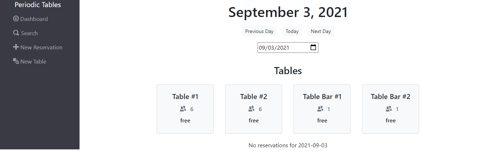
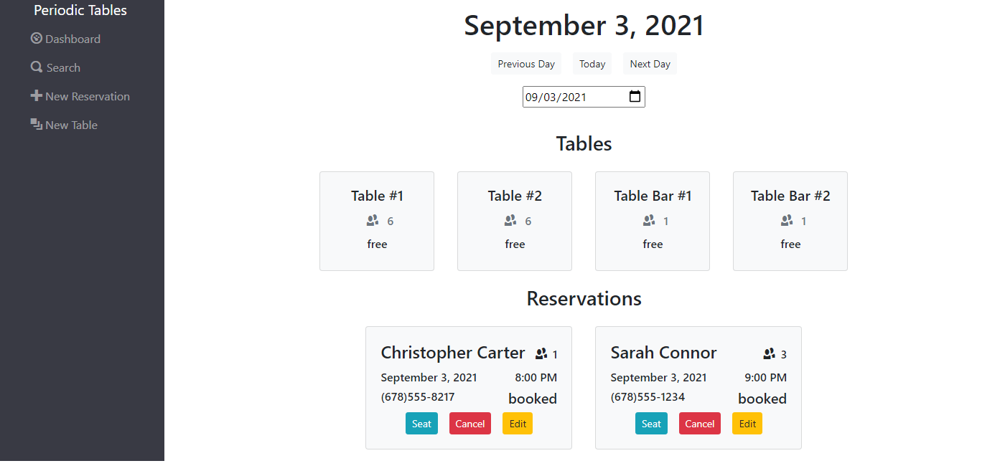
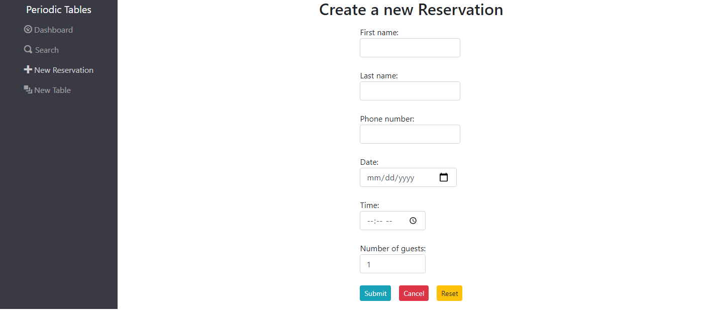
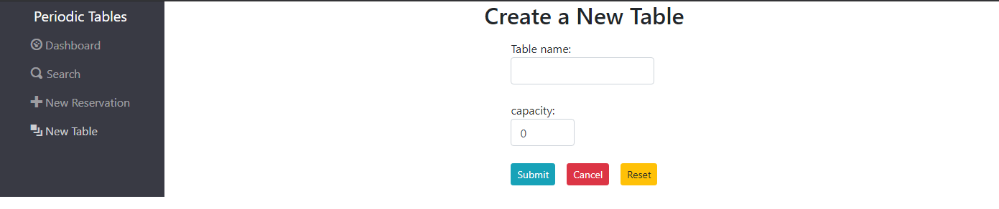
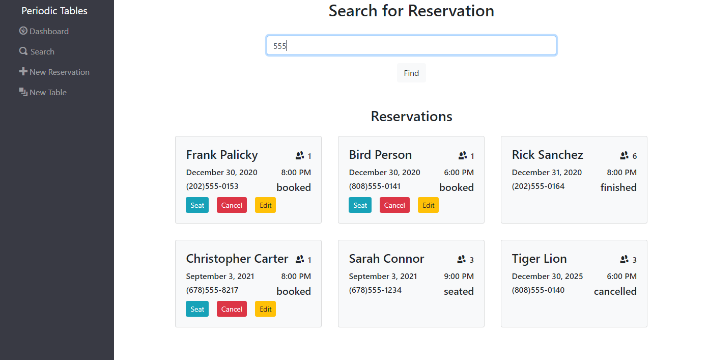

# Thinkful-Final-Capstone: Restaurant Reservation System   

## Live Demo
[Restaurant Reservation System](https://final-capstone-reservations-fe.herokuapp.com/dashboard "Restaurant Reservation System")


## Project Summary
A Restaurant Reservation System that is used to keep track of guest reservations and table assignments. The user can create new reservations and search for reservations by phone number. They can also keep track of where reservations are seated and tables are occupied.

### The Dashboard

### Dashboard with Reservation

### Dashboard with Seated Reservation

### Create new Reservation

### Create new Table

### Searh for Reservation



## Tech Stack
This web app was developed using HTML, CSS, JavaScript, BootStrap, React, Express, Node, PostgreSQL, and Knex.

## API Documentation

| Route       | Method      | Status Code | Description   |
| :---        |    :----:   |     :----:   |        ---:  |
| /reservations      | GET   | 200  | Returns a list of reservations for the current date |
| /reservations?date=####-##-##      | GET |  200    | Returns a list of reservations for the given date |
| /reservations      | POST  | 201    | Creates a new reservation |
| /reservations/:reservation_id      | GET  | 200     | Returns the reservation for the given ID |
| /reservations/:reservation_id      | PUT  | 200     | Updates the reservation for the given ID |
| /reservations/:reservation_id/status      | PUT  | 200     | Updates the status of the reservation for the given ID |
| /tables   | GET  | 200      | Returns a list of tables     |
| /tables   | POST  | 201      | Creates a new table     |
| /tables/:table_id   | GET   |   200   | Returns the table for the given ID     |
| /tables/:table_id/seat   | PUT | 200      | Seats a reservation at the given table_id     |
| /tables/:table_id/seat   | DELETE  | 200      | Changes the occupied status to be unoccupied for the given table_id     |


 ### Reservation JSON Example
 ```json
{
    "reservation_id": 7,
    "first_name": "Sarah",
    "last_name": "Connor",
    "mobile_number": "6785551234",
    "status": "booked",
    "reservation_date": "2021-09-03T04:00:00.000Z",
    "reservation_time": "21:00:00",
    "people": 3,
    "created_at": "2021-09-03T20:19:16.754Z",
    "updated_at": "2021-09-03T20:19:16.754Z"
}
```

### Table JSON Example
 ```json
{
   "table_id": 1,
    "table_name": "#1",
    "capacity": 6,
    "occupied": false,
    "reservation_id": null,
    "created_at": "2021-09-02T21:43:17.773Z",
    "updated_at": "2021-09-02T21:43:17.773Z"
}
```
## Installation
To install dependencies, use npm install.
```
npm install
```

To start the React web page, use npm start.
```
npm run start
```
Connect to a postgresql database by using the following command to create a .env file from the sample provided.
```js
cp .env.sample .env
```
Then fill in your .env file with your backend URL.
```js
// front-end .env example -> Connects to server
// REACT_APP_API_BASE_URL=http://localhost:5000
```  
    
 Make sure to grab the backend from   
     [Restaurant Reservation System Backend](https://github.com/chriscarter79/finalcapstone_backend "Restaurant Reservation System Backend")
